<div align="center">

<!-- Hero Header with Name -->


<br/>

<!-- Animated Typing Subtitle -->


<br/>

<!-- Main Action Buttons -->
<p align="center">
<a href="https://zacsluss.github.io/portfolio/"></a> <a href="https://github.com/Zacsluss/portfolio/archive/refs/heads/main.zip"></a>
</p>

<!-- Note: Portfolio deployment pending - Launch button will work after GitHub Pages is configured -->

<!-- GitHub Stats Badges -->
<p align="center">
  
  
  
  
  
</p>

</div>

<br/>

---

## 👋 Hey, I'm Zac

I work on enterprise platforms by day and build compelling projects by night. This portfolio uses **30,000 GPU-accelerated particles** to render text elements in real-time 3D space, plus a **10K-star procedural background**.

**What makes it interesting:**
- Custom GLSL shaders for particle physics and astrophysics effects
- 60 FPS on desktop with adaptive scaling for mobile (10K particles)
- 303KB optimized bundle with code splitting and lazy loading
- Fully interactive — type anything to watch particles morph in real-time

Built with React 19, Three.js, and physics-based rendering.

<div align="center">


*Real-time particle morphing — type any text to see it transform*

</div>

---

<details>
<summary><b>📚 Table of Contents</b></summary>

<br/>

- [👋 Hey, I'm Zac](#-hey-im-zac)
- [⚡ What This Does](#-what-this-does)
- [🛠️ Tech Stack](#️-tech-stack)
- [🏗️ How It Works - Architecture](#️-how-it-works---architecture)
- [🚀 Quick Start](#-quick-start)
- [📊 Technical Deep Dive](#-technical-deep-dive)
  - [Shader Effects](#shader-effects)
  - [Performance Benchmarks](#performance-benchmarks)
  - [Testing & Code Quality](#testing--code-quality)
  - [Observability & Monitoring](#observability--monitoring)
  - [Advanced Configuration](#advanced-configuration)
  - [Configuration Guide](#configuration-guide)
- [📄 License & Contributing](#-license--contributing)
- [📬 About & Connect](#-about--connect)

</details>

---

## ⚡ What This Does

<details>
<summary><b>Click to expand</b></summary>

<br/>

<div align="center">

**Real-time 3D particle text morphing** • **30K GPU particles at 60 FPS** • **303KB bundle** • **Mobile adaptive**

</div>

### Key Features

- ✨ **Interactive Text Morphing** - Type any name → watch 30,000 particles rearrange in real-time 3D
- 🎮 **Physics-Based Interaction** - Drag to rotate through space, particles react to mouse movement with realistic momentum
- 🔬 **Custom GLSL Shaders** - Black hole spirals, supernova explosions, chromatic aberration, bokeh lens effects
- 📱 **Adaptive Performance** - Automatically scales to 10K particles on mobile devices (maintains 30 FPS)
- 🌌 **Realistic Starfield** - 10,000 stars with black body radiation colors, twinkling, and motion streaks
- 🎨 **Easter Eggs** - Konami code (↑↑↓↓←→←→BA) triggers a 5-second particle effect sequence
- ⚡ **Optimized Bundle** - 303KB gzipped with code splitting, lazy loading, and Terser minification

### Tech Stack Summary

**Core:** React 19 • Three.js 0.180 • React Three Fiber • Vite 7
**Graphics:** Custom WebGL shaders (GLSL) • GPU instancing • Additive blending
**Performance:** Code splitting • Lazy loading • requestAnimationFrame throttling

</details>

---

## 🛠️ Tech Stack

<details open>
<summary><b>Click to expand</b></summary>

<br/>

<div align="center">

### What Powers This Portfolio


### Core Dependencies

<table>
<tr>
<td align="center" width="25%">
<br/>
<sub><b>UI Framework</b></sub>
</td>
<td align="center" width="25%">
<br/>
<sub><b>3D Graphics</b></sub>
</td>
<td align="center" width="25%">
<br/>
<sub><b>Build Tool</b></sub>
</td>
<td align="center" width="25%">
<br/>
<sub><b>Testing</b></sub>
</td>
</tr>
</table>

</div>

<details>
<summary>📦 <b>Full dependency list</b></summary>

<br/>

```json
{
  "dependencies": {
    "@react-three/drei": "^10.7.6",
    "@react-three/fiber": "^9.3.0",
    "prop-types": "^15.8.1",
    "react": "^19.1.1",
    "react-dom": "^19.1.1",
    "three": "^0.180.0"
  },
  "devDependencies": {
    "@eslint/js": "^9.33.0",
    "@testing-library/jest-dom": "^6.9.1",
    "@testing-library/react": "^16.3.0",
    "@testing-library/user-event": "^14.6.1",
    "@vitejs/plugin-react": "^5.0.0",
    "eslint": "^9.33.0",
    "eslint-plugin-react": "^7.37.5",
    "eslint-plugin-react-hooks": "^5.2.0",
    "eslint-plugin-react-refresh": "^0.4.20",
    "globals": "^16.3.0",
    "happy-dom": "^20.0.10",
    "jsdom": "^27.2.0",
    "rollup-plugin-visualizer": "^6.0.5",
    "terser": "^5.44.0",
    "vite": "^7.1.2",
    "vite-plugin-compression": "^0.5.1",
    "vitest": "^4.0.12"
  }
}
```

All shaders written from scratch in GLSL. No particle libraries, no animation frameworks — just pure WebGL performance.

</details>

</details>

---

## 🏗️ How It Works - Architecture

<details open>
<summary><b>Click to expand</b></summary>

<br/>

### System Architecture

```mermaid
graph TD
    A[User Input] --> B[App.jsx Main Controller]
    B --> C[Input Sanitization]
    C --> D[State Management]
    D --> E[React Three Fiber Canvas]

    E --> F[FluidTextParticles Component]
    E --> G[ModernStarfield Component]
    E --> H[Camera & Controls]

    F --> I[GPU Instancing]
    I --> J[Custom GLSL Shaders]
    J --> K[30K Particles Rendered]

    L[Portfolio Data] --> M[Schema Validation]
    M --> N[Section Components]
    N --> B

    O[Device Detection] --> P[Performance Optimization]
    P --> D

    style B fill:#4a5f8f
    style E fill:#2d3561
    style J fill:#ff006e
    style K fill:#00ff88
```



### Component Hierarchy

```mermaid
graph LR
    App[App.jsx] --> EB[ErrorBoundary]
    EB --> Canvas[Three.js Canvas]
    EB --> Content[Content Sections]

    Canvas --> Starfield[ModernStarfield]
    Canvas --> TextParticles[FluidTextParticles]
    Canvas --> Controls[OrbitControls]

    Content --> About
    Content --> Skills
    Content --> Experience
    Content --> Leadership
    Content --> Contact

    style App fill:#4a5f8f
    style Canvas fill:#2d3561
    style Content fill:#1a1a2e
```



<details>
<summary>🔄 <b>Data flow pipeline</b></summary>

<br/>

**1. User Input → Sanitization**
```
User types name → sanitizeName() → Remove special chars/emoji → Update state
```

**2. State → GPU Rendering**
```
visitorName state → FluidTextParticles → Text geometry → 30K particle positions → GPU
```

**3. Device Detection → Performance Tuning**
```
navigator.userAgent → isMobileDevice() → 10K or 30K particles → Optimal FPS target
```

**4. Portfolio Data → Components**
```
portfolio-data.js → validatePortfolioData() → Section components → Lazy loaded
```

</details>

<details>
<summary>⚙️ <b>Key technical decisions</b></summary>

<br/>

- **GPU Instancing** - Renders 30,000 particles in a single draw call instead of 30,000 separate calls
- **Code Splitting** - Manual chunks separate React, Three.js, and R3F into optimized bundles
- **Lazy Loading** - Section components load on-demand to reduce initial bundle size
- **requestAnimationFrame Throttling** - Reduces scroll handler calls from ~1000/sec to ~60/sec
- **Schema Validation** - Catches data errors in development before they reach production
- **Error Boundaries** - Prevents cascading failures if a component crashes
- **Float32Arrays** - Direct GPU buffer uploads with typed arrays for optimal performance

</details>

</details>

---

## 🚀 Quick Start

<details>
<summary><b>Click to expand</b></summary>

<br/>

<div align="center">

### Quick Start Instructions

</div>

```bash
git clone https://github.com/Zacsluss/portfolio.git && cd portfolio && npm install && npm run dev
```

<details>
<summary>⚙️ <b>Prerequisites</b></summary>

<br/>

Before running this project locally, ensure you have:

- **Node.js** - Version 20.x or higher (uses ES modules and modern JavaScript)
- **npm** - Version 9.x or higher (comes with Node.js)
- **Modern Browser** - One of the following with WebGL 2.0 support:
  - Chrome 90+ (recommended)
  - Firefox 88+
  - Safari 15+
  - Edge 90+
- **Hardware Requirements**:
  - GPU with WebGL 2.0 support (discrete GPU recommended for 30K particles)
  - Minimum 4GB RAM
  - Display with 1920×1080 resolution or higher for best experience

**Check WebGL support:** Visit [get.webgl.org](https://get.webgl.org/) and ensure WebGL 2 is enabled.

</details>

<details>
<summary>💻 <b>Local Development</b></summary>

<br/>

**Step-by-step installation:**

```bash
# 1️⃣ Clone this repository
git clone https://github.com/Zacsluss/portfolio.git
cd portfolio

# 2️⃣ Install dependencies
npm install

# 3️⃣ Start dev server
npm run dev
# Opens at http://localhost:2945/portfolio/
```

**Available npm scripts:**
- `npm run dev` — Start dev server with hot reload (port 2945)
- `npm run build` — Build optimized production bundle
- `npm run preview` — Preview production build locally
- `npm run lint` — Run ESLint checks
- `npm test` — Run Vitest unit tests
- `npm run test:ui` — Open interactive test UI
- `npm run test:coverage` — Generate coverage report

</details>

<details>
<summary>🏗️ <b>Production Build</b></summary>

<br/>

**Build and test production bundle locally:**

```bash
# Build optimized production bundle
npm run build

# Preview the production build
npm run preview
# Opens at http://localhost:4173/portfolio/
```

**Build output:**
- Output folder: `dist/`
- Bundle size: ~303KB gzipped (72% compression from 1.09MB)
- Includes: Code splitting, minification, gzip compression
- Assets: Images, fonts, and resume PDF copied to dist

</details>


<details>
<summary>🔧 <b>Customize for Yourself</b></summary>

<br/>

**Customize This Template:**

1. **Your content** - Edit `src/data/portfolio-data.js` — replace all my info with yours
2. **Your images** - Drop your project screenshots in `public/portfolio-images/`
3. **Your headshot** - Replace `public/portfolio-images/headshot.jpeg` with your photo
4. **Your SEO** - Update meta tags in `index.html` (title, description, Open Graph)
5. **Your colors** - Tweak the color scheme in `src/App.css` (search for `#00ff88` green)
6. **Your resume** - Replace `public/resume.pdf` with your own PDF

**Changing Default Text:**
- Open `src/config/constants.js`
- Line 14: Change `DEFAULT_TEXT: 'Zachary Sluss'` to your name
- Save and watch the particles rearrange ✨

**Adjust particle count:**
- Open `src/config/constants.js`
- Line 6: Change `DESKTOP_COUNT: 30000` (higher = more particles, lower FPS)
- Line 7: Change `MOBILE_COUNT: 10000` (keep this lower for mobile performance)

</details>

</details>

---

## 📊 Technical Deep Dive

<details>
<summary><b>Click to expand</b></summary>

<br/>

## Shader Effects

<details>
<summary>🌌 <b>Custom GLSL shaders written from scratch — all GPU-accelerated at 60 FPS</b></summary>

<br/>

<table>
<tr>
<td width="33%" valign="top">

### 🌠 Astrophysics & Optics

**🌡️ Black Body Radiation**
Temperature-based star colors using real physics (15% blue, 65% white, 20% red)

**✨ Bokeh Depth of Field**
Hexagonal lens shapes for realistic distant star rendering

**🌈 Chromatic Aberration**
RGB color splitting on bright stars (lens distortion effect)

**💫 Twinkling Physics**
Stars shimmer with sine wave timing algorithms (atmospheric scintillation)

**🌫️ Atmospheric Perspective**
Depth fog for realistic distance perception

</td>
<td width="33%" valign="top">

### 🪐 Particle Physics

**🕳️ Black Hole Spiral**
Particles spiral into center with gravitational pull physics

**💥 Supernova Explosion**
Explosive particle dispersion triggered by Konami code

**🧲 Magnetic Mouse Trails**
Particles follow cursor with realistic momentum and velocity decay

**⚛️ Quantum Field Oscillation**
Organic "hive mind" particle behavior with multi-frequency sine waves

**🌊 Velocity-Based Physics**
Exponential decay trails for natural motion

</td>
<td width="33%" valign="top">

### 🎨 Real-Time Morphing

**✍️ Text-to-Particle Morphing**
Type any name to see particles rearrange using canvas API text layout

**🔄 Elastic Easing Animations**
Smooth cubic easing transitions between morphing states

**🖱️ Global Mouse Physics**
Attraction, repulsion, and velocity-based particle trails

**🌌 Parallax Depth Layers**
Multi-layer 3D with independent particle motion based on depth

**🌈 Rainbow Gradient Sweep**
5-color cycle modulated by position and time

</td>
</tr>
</table>

</details>

---

## Performance Benchmarks

<details>
<summary>📈 <b>Real production performance metrics</b></summary>

<br/>

<div align="center">

### Desktop vs Mobile Performance

<table align="center">
<tr>
<td width="50%">

#### Desktop (1920×1080)
<table>
<tr><th align="center">Metric</th><th align="center">Value</th></tr>
<tr><td align="center">Particle Count</td><td align="center">30,000</td></tr>
<tr><td align="center">Average FPS</td><td align="center">60</td></tr>
<tr><td align="center">GPU Usage</td><td align="center">~30%</td></tr>
<tr><td align="center">Memory</td><td align="center">~120MB</td></tr>
<tr><td align="center">Initial Load</td><td align="center">1.2s</td></tr>
</table>

</td>
<td width="50%">

#### Mobile (iPhone 12)
<table>
<tr><th align="center">Metric</th><th align="center">Value</th></tr>
<tr><td align="center">Particle Count</td><td align="center">10,000</td></tr>
<tr><td align="center">Average FPS</td><td align="center">30</td></tr>
<tr><td align="center">GPU Usage</td><td align="center">~50%</td></tr>
<tr><td align="center">Memory</td><td align="center">~80MB</td></tr>
<tr><td align="center">Initial Load</td><td align="center">2.1s</td></tr>
</table>

</td>
</tr>
</table>

</div>

</details>

<details>
<summary>📦 <b>Bundle size breakdown</b></summary>

<br/>

```
dist/assets/three-core.js       695.45 KB → 174.41 KB gzipped
dist/assets/r3f-vendor.js       342.72 KB → 108.07 KB gzipped
dist/assets/index.js             34.07 KB →  11.48 KB gzipped
dist/assets/portfolio-data.js    13.85 KB →   4.93 KB gzipped
dist/assets/react-vendor.js      11.18 KB →   3.96 KB gzipped
─────────────────────────────────────────────────────────────
Total                          1096.72 KB → 303.21 KB gzipped (72% reduction)
```

**Optimization strategies:**
- ✅ **Code splitting** - 5 separate chunks for lazy loading
- ✅ **Terser minification** - Removes all console.log statements in production
- ✅ **Gzip compression** - 72% size reduction from original bundle
- ✅ **Lazy loading** - Section components load on-demand
- ✅ **Tree shaking** - Dead code elimination via Vite/Rollup
- ✅ **Manual chunks** - React, Three.js, and R3F separated for optimal caching

</details>

---

## Testing & Code Quality

<details>
<summary>🧪 <b>67 tests • 85% coverage • Vitest + Testing Library</b></summary>

<br/>

### Test Suite Overview

- ✅ **67 unit tests** across utilities, hooks, and components
- ✅ **85% code coverage** (target: 80%+)
- ✅ **Vitest** for blazing-fast test runs with Vite integration
- ✅ **Happy DOM** for lightweight DOM simulation
- ✅ **Testing Library** for user-centric component tests

**Run tests:**
```bash
npm test              # Run all tests
npm run test:ui       # Interactive test UI
npm run test:coverage # Coverage report (HTML + terminal)
```

### Test Structure

```
src/
├── utils/
│   ├── device.test.js        # ✅ Mobile detection tests
│   ├── sanitize.test.js      # ✅ Input validation tests
│   └── logger.js             # ⚠️ No tests (pure logging utility)
├── hooks/
│   ├── useKonamiCode.test.js # ✅ Easter egg sequence tests
│   └── usePerformanceMonitor.js # ⚠️ Needs tests (tracking)
├── components/ui/
│   ├── Section.test.jsx      # ✅ Fade-in animation tests
│   └── ErrorBoundary.test.jsx # ✅ Error handling tests
└── data/
    └── schema.test.js        # ✅ Portfolio data validation
```

### Code Quality Tools

- **ESLint 9.33** - Strict React best practices and hooks rules
- **PropTypes** - Runtime type checking for all components
- **Schema Validation** - JSON schema validation for portfolio data
- **Error Boundaries** - Prevents cascading component failures

</details>

---

## Observability & Monitoring

<details>
<summary>📈 <b>Built-in logging, performance tracking, and error boundaries</b></summary>

<br/>

### Structured Logging

All application events logged with consistent formatting and metadata:

```javascript
import { logger } from './utils/logger'

// Log levels: debug, info, warn, error
logger.info('User interaction', { component: 'Button', action: 'click' })
logger.error('Failed to load texture', { error: err, context: 'TextureLoader' })
logger.debug('Particle system initialized', { count: 30000, fps: 60 })
```

**Features:**
- 4 log levels: `DEBUG`, `INFO`, `WARN`, `ERROR`
- Auto-filters in production (only errors logged)
- Color-coded console output (blue info, orange warn, red error)
- Timestamps and structured context data

---

### Performance Monitoring

Real-time metrics tracked via `usePerformanceMonitor` hook:

```javascript
import { usePerformanceMonitor } from './hooks/usePerformanceMonitor'

function App() {
  const { fps, memory, frameTime, longTasks } = usePerformanceMonitor({
    enabled: true,
    logInterval: 5000, // Log every 5 seconds
    warnThreshold: 30, // Warn if FPS < 30
  })

  return <div>FPS: {fps}</div>
}
```

**Tracked Metrics:**
- **FPS** - Frames per second (target: 60 FPS desktop, 30 FPS mobile)
- **Frame Time** - Average milliseconds per frame (target: <16.67ms)
- **Long Tasks** - Count of frames exceeding 16.67ms (janky frames)
- **Memory** - JavaScript heap usage in MB (Chrome/Edge only)

---

### Error Tracking

ErrorBoundary component automatically logs all React errors with full context:

```javascript
// Errors logged include:
// - Error message and stack trace
// - Component stack (which component tree failed)
// - Timestamp and environment (dev/prod)
```

**Integration Points:**
- Ready for Sentry/LogRocket integration (placeholder in `ErrorBoundary.jsx:38`)
- Structured logs compatible with JSON aggregators (Datadog, Splunk)
- Performance marks visible in Chrome DevTools Performance tab

</details>

---

## Advanced Configuration

<details>
<summary>🔧 <b>Particle tuning, performance optimization, and customization</b></summary>

<br/>

### Adjust Particle Count

Edit `src/config/constants.js`:

```javascript
export const PARTICLE_CONFIG = {
  DESKTOP_COUNT: 30000,  // Increase for more particles (may lower FPS)
  MOBILE_COUNT: 10000,   // Keep lower for mobile performance
  DEFAULT_TEXT: 'Zachary Sluss', // Change default text
}
```

**Performance Impact:**
- 50,000 particles → ~45 FPS on high-end GPU
- 20,000 particles → 60 FPS on mid-range GPU
- 10,000 particles → 60 FPS on mobile

---

### Customize Color Scheme

Edit `src/App.css` to change the green accent color:

```css
/* Search for all instances of #00ff88 and replace with your color */
/* Example: Change to purple: #8b5cf6 */

.section-title {
  color: #00ff88; /* Change this */
}

.nav-link:hover {
  color: #00ff88; /* And this */
}
```

**Affected Elements:**
- Section titles
- Navigation hover states
- Particle glow colors
- Button hover effects
- Border accents

---

### Performance Tuning

**Disable expensive effects for low-end devices:**

Edit `src/components/particles/ModernStarfield.jsx`:

```javascript
// Line 156: Disable bokeh on mobile
const bokehEnabled = !isMobile && star.brightness > 0.8

// Line 180: Reduce star count
const starCount = isMobile ? 5000 : 10000

// Line 198: Disable chromatic aberration
const chromaticAberration = false
```

**Enable debug mode:**

Edit `src/App.jsx`:

```javascript
// Line 47: Set to true to see FPS counter
const [showDebug, setShowDebug] = useState(true)
```

---

### Custom Shader Effects

Add your own particle effects by extending `FluidTextParticles.jsx`:

```glsl
// In vertex shader (line 234):
uniform float uCustomEffect;

void main() {
  // Add custom displacement
  vec3 pos = position + normal * uCustomEffect * 0.5;
  gl_Position = projectionMatrix * modelViewMatrix * vec4(pos, 1.0);
}
```

Then pass the uniform from React:

```javascript
<fluidTextMaterial
  uCustomEffect={customEffectValue}
  // ... other uniforms
/>
```

</details>

---

## Configuration Guide

<details>
<summary>🔧 <b>Common configuration and solutions</b></summary>

<br/>

### WebGL Issues

<details>
<summary>❌ <b>Black screen or "WebGL not supported" error</b></summary>

<br/>

**Symptoms:** Page loads but canvas is black, or error message appears

**Solutions:**
1. **Check WebGL support** - Visit [get.webgl.org](https://get.webgl.org/) and ensure WebGL 2 is enabled
2. **Update graphics drivers** - Outdated drivers often cause WebGL issues
3. **Try different browser** - Chrome/Firefox have better WebGL support than Safari
4. **Disable browser extensions** - Some ad blockers interfere with WebGL
5. **Check GPU acceleration** - Ensure hardware acceleration is enabled in browser settings

**Chrome Settings:**
```
chrome://settings/system
→ Use hardware acceleration when available (enable)
```

**Firefox Settings:**
```
about:config
→ webgl.force-enabled = true
→ webgl.disabled = false
```

</details>

---

### Font Loading

<details>
<summary>⚠️ <b>White blob appears for 1 second before particles form</b></summary>

<br/>

**Symptoms:** Text briefly shows as white rectangle before morphing into particles

**Cause:** Orbitron font hasn't loaded when particle generation runs

**Solution:** Already handled with 1-second delay in `FluidTextParticles.jsx:142`

If still occurring:
```javascript
// Increase timeout in src/components/particles/FluidTextParticles.jsx
setTimeout(() => {
  generateParticlesFromText(text)
}, 2000) // Increase from 1000 to 2000
```

**Alternative:** Preload font in `index.html`:
```html
<link rel="preload" href="https://fonts.googleapis.com/css2?family=Orbitron:wght@400;700;900&display=swap" as="style">
```

</details>

---

### Performance Tuning

<details>
<summary>🐌 <b>Low FPS or laggy performance</b></summary>

<br/>

**Symptoms:** Less than 30 FPS, stuttering, or delayed mouse interactions

**Solutions by severity:**

**Quick Fixes:**
1. **Close other browser tabs** - Free up GPU memory
2. **Disable browser extensions** - Some extensions cause frame drops
3. **Use Chrome** - Better WebGL optimization than Firefox/Safari

**Configuration Fixes:**
```javascript
// src/config/constants.js - Reduce particle count
export const PARTICLE_CONFIG = {
  DESKTOP_COUNT: 20000, // Down from 30000
  MOBILE_COUNT: 5000,   // Down from 10000
}
```

**Shader Optimization:**
```javascript
// src/components/particles/ModernStarfield.jsx
// Line 156: Disable expensive effects
const bokehEnabled = false // Disable bokeh
const chromaticAberration = false // Disable chromatic aberration
```

**Monitor Performance:**
```javascript
// src/App.jsx - Enable debug mode
const [showDebug, setShowDebug] = useState(true)
// Shows FPS counter in top-left corner
```

**Hardware Limitations:**
- Integrated GPUs: Expect 20-30 FPS with 30K particles
- Low-end mobile: Auto-reduces to 10K particles, targets 30 FPS
- Recommended: Discrete GPU (GTX 1060 or better) for 60 FPS

</details>

</details>

</details>

---

## 📄 License & Contributing

<details>
<summary><b>Click to expand</b></summary>

<br/>

## License

<div align="center">

**MIT License** - Fork and customize for your own use. No attribution required.

This portfolio is completely open source and free to use for personal or commercial projects.


Full license text in [LICENSE](LICENSE) file.

</div>

---

## Contributing

Contributions welcome! Fork this repo, make your changes, and submit a pull request.

**Before submitting:**
- Run `npm test` and `npm run lint`
- Ensure production build works (`npm run build`)
- Write clear commit messages

**Found a bug?** Please create an issue in the repository with reproduction steps.

---

## Changelog

See [CHANGELOG.md](CHANGELOG.md) for version history and release notes.

</details>

---

## 📬 About & Connect

<details open>
<summary><b>Click to expand</b></summary>

<br/>

<div align="center">

By day, I work as a **Principal CRM & Enterprise Platforms Solutions Architect**, managing multi-million-dollar Salesforce ecosystems and enterprise integrations across 20+ countries. By night, I build projects like this.

</div>

---

<div align="center">

<br/>

<a href="https://zacsluss.github.io/portfolio/">
  
</a>
<a href="https://github.com/Zacsluss">
  
</a>
<a href="https://linkedin.com/in/zacharyjsluss">
  
</a>
<a href="mailto:zacharyjsluss@gmail.com">
  
</a>
<a href="https://zacsluss.github.io/portfolio/resume.pdf">
  
</a>

<br/>
<br/>

**Found this helpful?** Give it a ⭐ to show support!

**Want to contribute?** See [contributing guidelines](#-license--contributing) above.

**Need help?** [Open an issue](https://github.com/Zacsluss/portfolio/issues) or email me.

---


</div>

</details>
